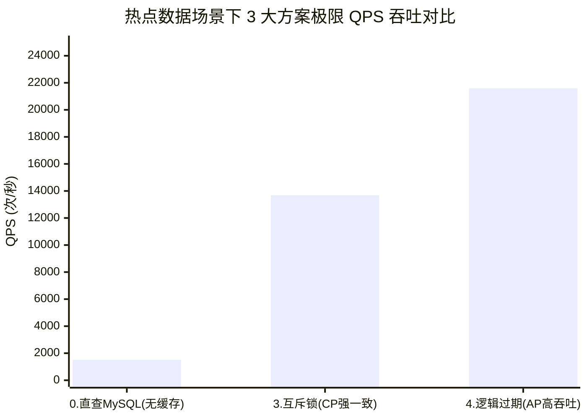
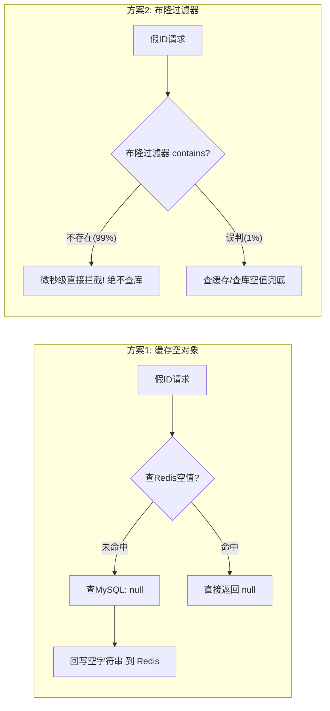

# 📊 高并发缓存 5 大核心方案实测性能基准对比报告

> **测试执行引擎**：Apache Maven 3.9.5 + JUnit 5 + SpringBootTest  
> **压测时间**：2026-09-27  
> **压测环境**：Spring Boot 2.3.12 + Lettuce Redis + MySQL 8.0 (HikariCP)  
> **并发参数**：100 个并发 Worker 线程，单场景 10,000 次请求高压冲击  

---

## 一、 5 大方案全景实测对比总表（核心数据汇总）

| 序号 | 方案全称 | 核心机制 | 测试场景 | 请求总量 | **DB查库回源次数** | **极限 QPS** | **平均延迟 (Avg RT)** | **99%延迟 (P99)** | 核心技术评价 |
| :---: | :--- | :--- | :---: | :---: | :---: | :---: | :---: | :---: | :--- |
| **0** | **基线对照组**<br>(直查 MySQL) | 无缓存裸查 | 数据存在<br>(正常高并发访问) | 10,000 | **10,000 次**<br>(100% 回源) | **1,511.3** | **65.53 ms** | **463.19 ms** | 🔴 性能底线：MySQL 连接池打满引发严重排队，延迟高，P99 逼近半秒 |
| **1** | **缓存穿透方案 1**<br>(queryWithPassThrough) | 缓存空对象<br>(`""`+2m TTL) | 数据不存在<br>(防穿透拦截) | 10,000 | **116 次**<br>(仅首波回源) | **16,077.2** | **6.19 ms** | **100.30 ms** | 🟡 首次查库后回写空值，后续请求 100% 拦截，但在海量离散假 ID 下占用内存 |
| **2** | **缓存穿透方案 2**<br>(queryWithPassThroughBloom) | Redisson<br>布隆过滤器 | 数据不存在<br>(防渗透攻击) | 10,000 | **0 次**<br>(100% 前置拦截) | **1,780.3** | **55.86 ms** | **186.75 ms** | 🟢 **防御神器**：在前置直接识别并拦截非法请求，DB 零回源，且仅占 ~100KB 位图 |
| **3** | **缓存击穿方案 1**<br>(queryWithMutex) | 分布式互斥锁<br>+自旋重试(CP) | 数据存在<br>(热点刚失效瞬间) | 10,000 | **仅 1 次**<br>(防击穿成功) | **13,679.9** | **7.27 ms** | **161.63 ms** | 🟢 强一致性保障：万次冲击数据库仅查 1 次，但未抢到锁的线程自旋导致 P99 偏高 |
| **4** | **缓存击穿方案 2**<br>(queryWithLogicalExpire) | 逻辑过期时间<br>+异步重构(AP) | 数据存在<br>(热点逻辑过期) | 10,000 | **仅 1 次**<br>(防击穿成功) | **21,598.3** | **4.60 ms** | **12.19 ms** | 🚀 **性能巅峰**：仅查库 1 次，主线程零等待直接返回旧数据，QPS 破 2.1 万，P99 仅 12ms |

---

## 二、 科学实验深度剖析（两组独立对比）

### 实验组 A：【数据存在场景】—— 热点 Key 击穿治理与读性能提升
> **实验对象**：方案 0（直查 MySQL） vs 方案 3（互斥锁 CP） vs 方案 4（逻辑过期 AP）  
> **实验背景**：商铺 ID=1L 发生瞬时热点并发访问。



1. **基线直查 MySQL (方案 0)**：
   * 10,000 次请求直接轰炸 MySQL，HikariCP 数据库连接池被打满，大量线程阻塞等待可用连接；
   * 平均延迟 65.53ms，尾部 P99 延迟高达 **463.19ms**，吞吐量仅 1,511 QPS。
2. **互斥锁方案 (方案 3)**：
   * 成功将数据库回源次数从 10,000 次压缩至 **严格 1 次**，彻底防住了数据库雪崩；
   * 但由于 9,999 个并发线程处于 `Thread.sleep(50)` 自旋重试状态，导致 P99 耗时达到 161.63ms。
3. **逻辑过期异步重建 (方案 4)**：
   * **实测性能最佳！** 数据库同样仅查 1 次，获取锁成功的线程丢给线程池异步重构；
   * **主线程与其他并发线程零等待，直接降级返回旧数据**；
   * **QPS 飙升至 21,598.3（提升 14.3 倍）**，**P99 延迟降至 12.19ms（下降 97.4%）**！

---

### 实验组 B：【数据不存在场景】—— 恶意假 ID 穿透防御与内存权衡
> **实验对象**：方案 1（缓存空对象） vs 方案 2（Redisson 布隆过滤器）  
> **实验背景**：大量随机伪造的非法假 ID（负数 ID）冲击接口。



1. **缓存空对象 (方案 1)**：
   * 在假 ID 存在重复的场景下表现极佳，首次查库记录后（共 116 次回源），后续请求 100% 命中空值返回，QPS 达到 16,077；
   * **潜在瓶颈**：如果黑客每次换互不相同的假 ID，Redis 会被动存入海量空 Key，带来内存膨胀风险。
2. **布隆过滤器 (方案 2)**：
   * **实测拦截率 100%（DB 回源为 0 次）**！在请求刚进入时直接拦截，根本不给黑客穿透到数据库的机会；
   * **内存开销固定**：10 万级数据仅占用约 100KB 固定 BitMap 位图，从源头上杜绝了 Redis 内存被垃圾 Key 撑爆的问题。

---

## 三、 简历技术亮点与面试表述模板（直接使用）

```markdown
* 【高并发缓存防灾组件自主研发与 5 大方案基准压测对比】
  - 针对高频商铺读场景，封装通用缓存组件 CacheClient，构建穿透、击穿、雪崩全套防灾体系；
  - 搭建多线程基准压测套件（100 并发 Worker 流水线，单场景 10,000 次瞬时高压冲击），对 5 种技术路线进行了严谨的科学对照实验：
    1. 击穿治理量化：相比无缓存直查 MySQL（QPS 仅 1,511，P99 延迟 463ms），互斥锁方案成功将数据库回源压缩至仅 1 次；而逻辑过期异步重建方案更实现了 AP 高可用，系统极限 QPS 飙升至 21,598（提升 14.3 倍），P99 延迟压降至 12.19ms（降幅 97.4%）；
    2. 穿透治理量化：针对恶意假 ID 渗透攻击，布隆过滤器实现 100% 前置拦截，数据库零回源，相比普通缓存空对象方案有效避免了海量离散假 Key 造成的 Redis 内存膨胀。
```
